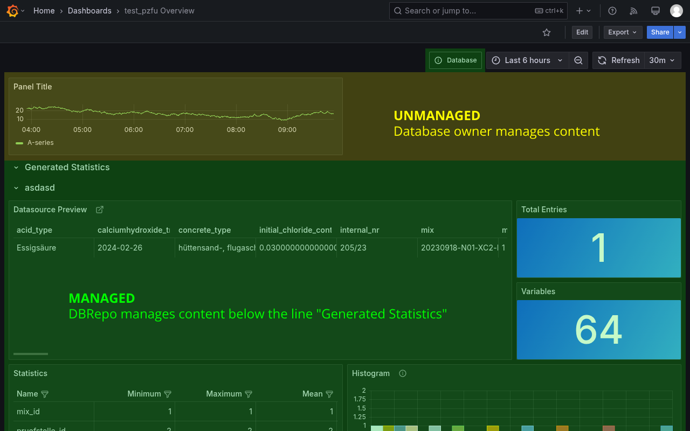

We use [Grafana](https://grafana.com) to display and automatically generate dashboards that describe a dataset.

## Provisioned Dashboards

Every provisioned dashboard consists of two areas:

1. **Unmanaged**: this area can be modified by the database owner and is not affected by provisioning. It is the area
   above the "Generated Statistics" row.
2. **Managed**: this area is affected by provisioning, any changes to this area will be overridden and deleted without
   notice. Note that the dashboard links are also affected by provisioning.

Everytime the views of the database change (e.g. a new view is added, a view is deleted) then the dashboard for this
database is provisioned.

<figure id="fig1" markdown>

<figcaption>Figure 1: Generated dashboard containing unmanaged (yellow) and managed (green) content.</figcaption>
</figure>

!!! question "How do I disable managed dashboards?"

    If you prefer not to have automatically-generated dashboards, you can disable managed dashboards for a database
    in the UI. Go to **your database** > **Settings** > **Visibility** > **Managed Dashboard** > **Disabled**.