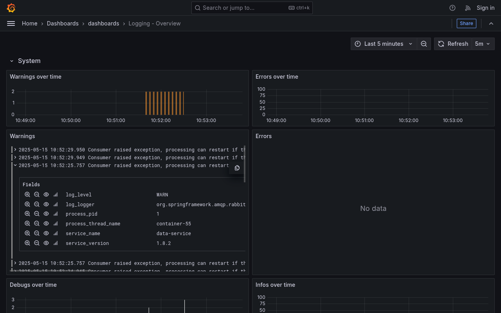

:octicons-tag-16:{ title="Minimum version" } 1.8.2

DBRepo uses the lightweight open-source logging framework [fluentbit](https://fluentbit.io) to collect, parse and
forward logs to the [Search Database](../../api/search-db).

!!! info "Only available in the Kubernetes deployment"

## Collection

The [Data Service](../../api/data-service) and [Metadata Service](../../api/metadata-service) use Slf4j as logging
facade. Logs are collected with a sidecar in each pod. They are collected with the `tail` plugin from the log files. 
For the Data-, Metadata-, Analyse-, Dashboard- and Search Services, the application log is located in
`/var/log/app/service/<name>/app.log` (e.g. `/var/log/app/service/search/app.log` for the Search Service). All log to
console (`/dev/stdout`) as well to the log file simultaneously. The log files are structured and formatted according to
the [Elastic Common Schema](https://www.elastic.co/docs/reference/ecs/logging/intro) (ECS) format such that no parsing
(except `@timestamp`) is needed.

## Parse

The logs are parsed directly in the config file of the sidecar. The config file is always located in 
`/opt/bitnami/fluent-bit/conf/parsers.conf` and contains the parsing regex. By default, the pre-defined `docker`
parser is used that performs lightweight parsing by just parsing the logs as JSON.

## Storage

After parsing, the logs are sent to the [Search Database](../../api/search-db) where they are stored as documents in
the index `logging`.

## Insights

The logs can be inspected in the operational dashboard in `https://<hostname>/dashboard/d/aejhojr0mrpj4c` to gain
insight on potential errors.

<figure markdown>

<figcaption>Figure 1: Operational Dashboard for Logging</figcaption>
</figure>
