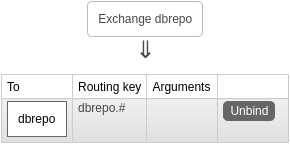

We use the message broker RabbitMQ and a single exchange with distributed (`quorum`) queue. Both are named `dbrepo`.

<figure markdown>

<caption>Figure 1: Exchange binding in DBRepo.</caption>
</figure>

## Tuple

A tuple is the atomic granularity of information when transmitting data through message-queue systems. Represented as
JSON, a tuple looks like this in RabbitMQ:

```JSON
{"firstname": "foo", "lastname":  "bar"}
```

## AMQP

DBRepo uses AMQP to route messages which allows for both Basic/Bearer authentication. For more information please
consult the [RabbitMQ AMQP](https://www.rabbitmq.com/tutorials/amqp-concepts) documentation.

## MQTT

:octicons-tag-16:{ title="Minimum version" } 1.5.0

DBRepo supports MQTT for IoT with Basic authentication.