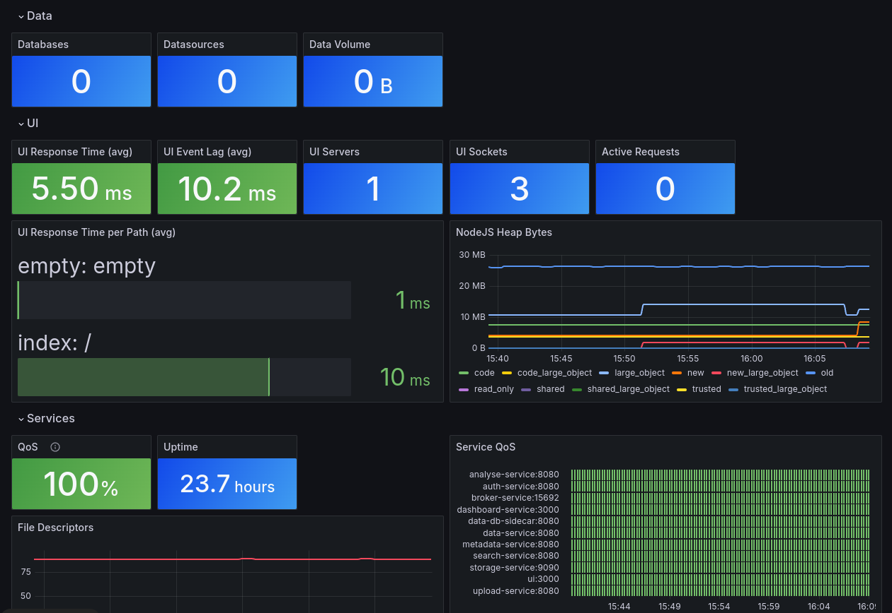
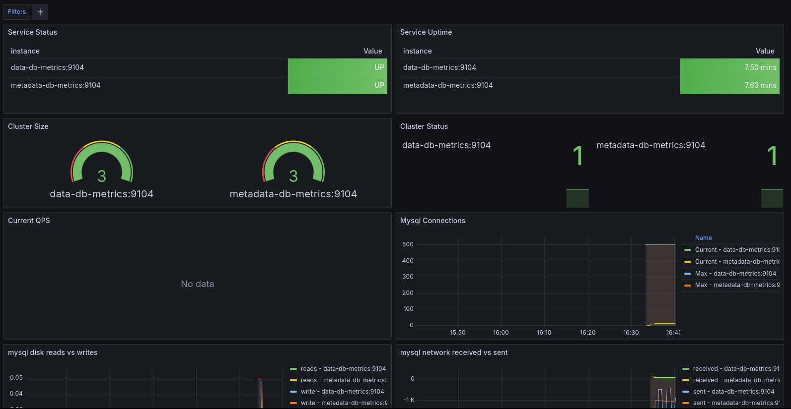
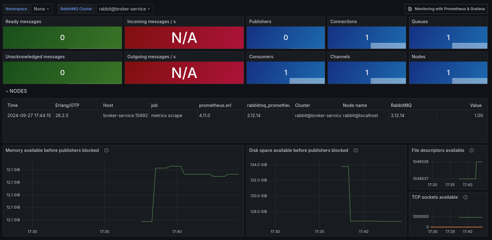

## Prometheus Metrics

We expose Prometheus metrics on all endpoints of the REST API. [Prometheus](https://prometheus.io/) is a cloud-native
monitoring system using a time-series database. In the default deployment (Docker Compose / Kubernetes) no Prometheus
instance is started.

You need can setup Prometheus in a few minutes using
a [Docker container](https://prometheus.io/docs/prometheus/latest/installation/).

## Dashboards

<figure markdown>

<figcaption>Figure 1: DBRepo Dashboard</figcaption>
</figure>

<figure markdown>

<figcaption>Figure 2: Database Dashboard (Kubernetes deployment only)</figcaption>
</figure>

<figure markdown>

<figcaption>Figure 3: Broker Service Dashboard</figcaption>
</figure>