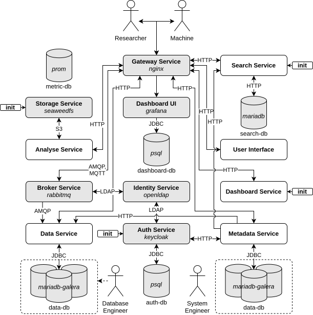

This is the full system description from a technical/developer view and continuously being updated as the development
progresses. 

The remainder of this Sec. is organized as follows: in [Authentication](../concepts/authentication)
we describe how to to accessing important parts of DBRepo. Sec. [DBMS](../concepts/dbms) describes database management
systems on a high-level, Sec. [Messaging](../concepts/messaging) shows how data streams can be connected with DBRepo for
e.g. continuous sensor measurements. Sec. [(Meta-)Data](../concepts/metadata) describes the data derived from the
datasets, Sec. [Persistent Identifier](../concepts/pid) introduces how data is precisely identified for e.g. citation
using the DOI system. Sec. [Search](../concepts/search) describes how anything in DBRepo can be searched, Sec.
[Storage](../concepts/storage) shows how datasets can be uploaded/transferred between the services and Sec. 
[User Interface](../concepts/ui) introduces the graphical interface for human interaction as part of virtual research
environments.

## Architecture

The repository is designed as a service-based architecture to ensure scalability and the utilization of various
technologies. The conceptualized microservices (c.f. [Fig. 1](#fig1)) operate the basic database operations, data versioning as well as
*findability*, *accessability*, *interoperability* and *reuseability* (FAIR).

<figure id="fig1" markdown>
<<<<<<<< HEAD:docs/dev/old/index.md

========

<figcaption>Fig. 1: Architecture of the services</figcaption>
>>>>>>>> master:docs/dev/concepts/index.md
</figure>