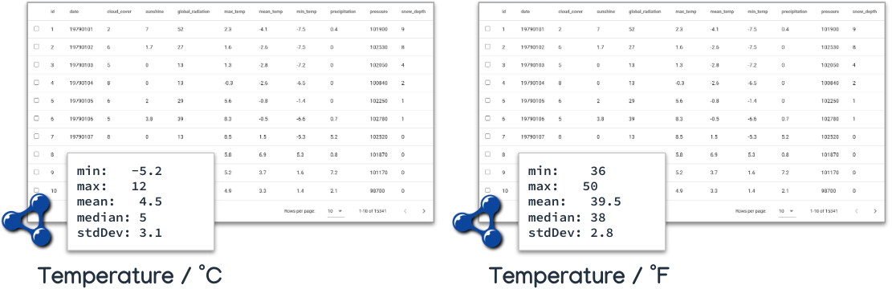
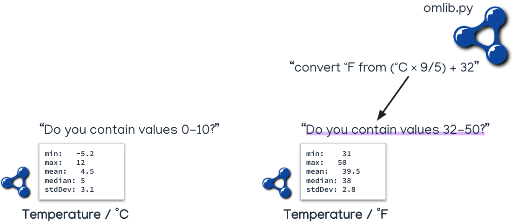

## Document

Each database in DBRepo has their own document where the document id (the identifier of a database in OpenSearch) is
equivalent to the database id (the identifier of a database in
the [Metadata Database](/infrastructures/dbrepo/dev/services/metadata-db)).

## Unit Independent Search

Since the repository automatically collects statistical properties (min, max, mean, median, std.dev) in both the
[Metadata Database](/infrastructures/dbrepo/dev/services/metadata-db) and the Search Database, a special search can be performed when at least two
columns have the same semantic concept (e.g. temperature) annotated and the units of measurements can be transformed.

<figure markdown>
<<<<<<<< HEAD:docs/dev/old/search.md

========

<figcaption>Figure 3: Two tables with compatible semantic concepts and units of measurement</figcaption>
>>>>>>>> master:docs/dev/concepts/search.md
</figure>

In short, the search service transforms the statistical properties not in the target unit of measurements is transformed
by using the [`omlib`](https://github.com/dieudonneWillems/OMLib) package.

For example: a user wants to find datasets that contain *"temperature measurements between 0 - 10 &deg;C"*. Then the
search service transforms the query to the dataset on the right from &deg;F to contain *"temperature measurements
between 32 - 50 &deg;F"* instead.

<figure markdown>
<<<<<<<< HEAD:docs/dev/old/search.md

========

<figcaption>Figure 4: Unit independent search query transformation</figcaption>
>>>>>>>> master:docs/dev/concepts/search.md
</figure>