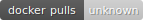

# DBRepo

{ tabindex=-1 }
{ tabindex=-1 }
{ tabindex=-1 }
{ tabindex=-1 }
{ tabindex=-1 }
{ tabindex=-1 }

Documentation for version: [v1.13.3](https://github.com/DBRepo-Project/dbrepo/releases) (as [PDF](dbrepo_v1.13.3.pdf)).

DBRepo is an open-source database repository that cover the data life cycle supporting data evolution,
-citation and -versioning. It implements the query store of the [RDA WGDC](https://doi.org/10.1162/99608f92.be565013) on
precisely identifying arbitrary subsets of data.

## Why use DBRepo?

* **Built-in search** makes your dataset searchable without extra effort: metadata is generated automatically for data
  in your databases.
* **Citable datasets** adopting the recommendations of the RDA-WGDC, arbitrary subsets can be precisely, persistently
  identified using data versioning of MariaDB and the DataCite schema for minting DOIs.
* **Powerful API for Data Scientists** with our strongly typed Python Library, Data Scientists can import, export and
  work with data from Jupyter Notebook or Python script, optionally using Pandas DataFrames.
* **Cloud Native** our lightweight Helm chart allows for installations on any cloud provider or private-cloud setting
  that has an underlying PV storage provider.

Installing DBRepo is very easy or
[give it a try online](user-guide/quickstart/).

## Who is using DBRepo?

- [TU Wien](https://dbrepo.datalab.tuwien.ac.at) (Austria)
- EGI (pan-European)
- Institut Teknologi Bandung (Indonesia)
- TU Darmstadt (Germany)
- TU Graz (Austria)
- Universit&auml;t Hamburg (Germany)
- Universitas Gadjah Mada (Indonesia)
- Universiti Sains Malaysia (Malaysia)
- Universiti Teknikal Malaysia Melaka (Malaysia)
- University of the Philippines Diliman (Phillipines)

Stay up to date and [subscribe to our mailing list](mailto:sympa@list.tuwien.ac.at?subject=subscribe dbrepo) for
quarterly news on DBRepo. You can [unsubscribe](mailto:sympa@list.tuwien.ac.at?subject=unsubscribe dbrepo) too.

## How can I try DBRepo?

There's a hosted [test environment](https://test.dbrepo.tuwien.ac.at) maintained
by [DS-IFS](https://informatics.tuwien.ac.at/orgs/e194-04) where you can explore DBRepo using your existing account.

[:fontawesome-solid-flask: &nbsp;Demo Environment](https://test.dbrepo.tuwien.ac.at){ .md-button .md-button--primary target="_blank" }
