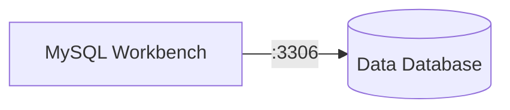

<center>

</center>

A user wants to import a database dump in `.sql` (or in `.sql.gz`) format into DBRepo.

### UI

Import the database dump `dump.sql` via the [MySQL Workbench](https://www.mysql.com/products/workbench/) client which is 
semi-compatible with MariaDB databases, i.e. core features work some status/performance features do not.

Setup a new connection in the MySQL Workbench by clicking the small 
":material-plus-circle-outline:" button :material-numeric-1-circle-outline: to open the dialog. In the opened dialog
fill out the connection parameters (for local deployments the hostname is `127.0.0.1` and port `3307` for the
Data Database :material-numeric-2-circle-outline:.

The default credentials are username `root` and password `dbrepo`, type the password in 
:material-numeric-3-circle-outline: and click the "OK" button. Then finish the setup of the new connection by
clicking the "OK" button :material-numeric-4-circle-outline:.

<figure markdown>


Now you should be able to see some statistics for the Data Database, especially that it is running
:material-numeric-1-circle-outline: and basic connection and version information :material-numeric-2-circle-outline:.

<figure markdown>

</figure>

Then proceed to import the database dump `dump.sql` by clicking "Data Import/Restore" 
:material-numeric-1-circle-outline: and select "Import from Self-Contained File" in the Import Options. Then
select the `dump.sql` file in the file path selection. Last, select the database you want to import this `dump.sql`
into :material-numeric-4-circle-outline: (you can also create a new database for the import by clicking "New...").
The import starts after clicking "Start Import" :material-numeric-5-circle-outline:.

<figure markdown>

</figure>

### Terminal

First, create a new database as descriped in the [Create Database](#create-database) use-case above. Then, import
the database dump `dump.sql` via the `mariadb` client.

```bash
mariadb -H127.0.0.1 -p3307 -uUSERNAME -pYOURPASSWORD db_name < dump.sql
```

Alternatively, if your database dump is compressed, import the `dump.sql.gz` by piping it through `gunzip`.

```bash
gunzip < dump.sql.gz | mysql -H127.0.0.1 -p3307 -uUSERNAME -pYOURPASSWORD db_name
```
