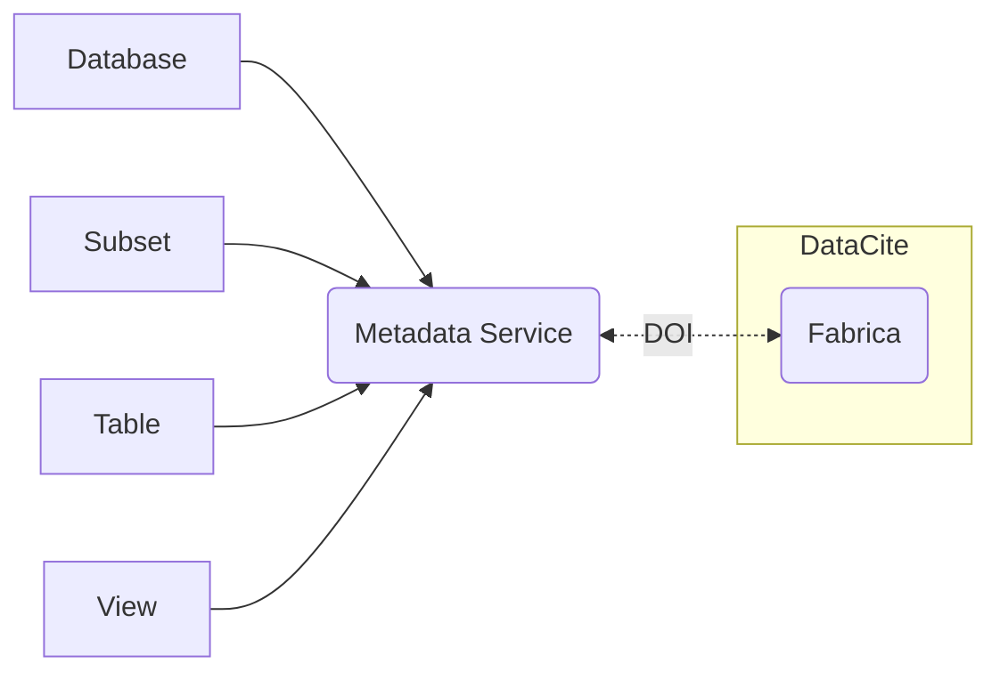

<center>

</center>

A persistent identifier (PID) stores metadata redundant in an external system that issues them (i.e. DataCite for DOIs).
DBRepo supports PIDs in the form of URIs and can be optionally configured to use DOIs from DataCite.

A user wants to assign a PID to a data source, e.g. subset, owned or created by them.

### UI

The subset can be persistently identified by creating a PID via the "Get PID" button in the toolbar of each data source.
If you do not have a PID already from another system, you can create one. This is the default action.

First, provide information on the dataset creator(s), if possible, provide a PID on the person or organization. In some
cases these will automatically be resolved (i.e. ORCID, ROR, DOI) and an attempt to load external metadata will be made.
Using PIDs improves the accuracy of the PID record.

In case no PID is available, start by selecting the creator type (natural person or organization).

Fill out the given name, i.e. firstname(s) and family name, i.e. lastname(s). Both form the mandatory field name and
should have the form `family name, given name`.

If available, provide the PID of your affiliation (e.g. [`https://ror.org/04d836q62`](https://ror.org/04d836q62)), which
increases accuracy of the PID record. If not, optionally provide an affiliation name.

<video autoplay loop>
  <source src="/videos/create-pid-1.webm" type="video/webm" />
  <source src="/videos/create-pid-1.mp4" type="video/mp4" />
</video>

The PID needs at least one title in the title field and optionally a title type from the selection and optionally a
title language from the available list of languages.

Add additional title(s) where needed, a PID can have multiple titles.

<video autoplay loop>
  <source src="/videos/create-pid-2.webm" type="video/webm" />
  <source src="/videos/create-pid-2.mp4" type="video/mp4" />
</video>

The PID needs at least one description in the description field and optionally a description type from the selection and
a description language.

Optionally provide a text description on the collection method and description of the dataset. This information greatly
enhances (re-)usability of your data. You can remove those sections by clicking "Remove".

<video autoplay loop>
  <source src="/videos/create-pid-3.webm" type="video/webm" />
  <source src="/videos/create-pid-3.mp4" type="video/mp4" />
</video>

The dataset publisher in most cases is the organization that operates the DBRepo service.

Provide a publication year and optionally a publication month and publication day. In case of imported data, this date
corresponds to the *original* publishing date.

<video autoplay loop>
  <source src="/videos/create-pid-4.webm" type="video/webm" />
  <source src="/videos/create-pid-4.mp4" type="video/mp4" />
</video>

Optionally reference other PIDs, and add a license from the list.

Optionally provide the main language for the PID record. This helps machines to understand the context of
your data.

Optionally add funding information. When you are finished


<video autoplay loop>
  <source src="/videos/create-pid-5.webm" type="video/webm" />
  <source src="/videos/create-pid-5.mp4" type="video/mp4" />
</video>

### Python

```python
from dbrepo.RestClient import RestClient
from python.dbrepo.api.dto import IdentifierType, CreateIdentifierFunder, CreateIdentifierDescription, \
    CreateIdentifierTitle, Identifier, CreateIdentifierCreator, CreateRelatedIdentifier, RelatedIdentifierType, \
    RelatedIdentifierRelation

client = RestClient(endpoint="http://<hostname>", username="foo",
                    password="bar")
identifier = client.create_identifier(<database_id>,
                                      type=IdentifierType.DATABASE,
                                      creators=[CreateIdentifierCreator(
                                          creator_name="Weise, Martin",
                                          name_identifier="https://orcid.org/0000-0003-4216-302X")],
                                      titles=[CreateIdentifierTitle(
                                          title="Danube river water measurements")],
                                      descriptions=[CreateIdentifierDescription(
                                          description="This dataset contains hourly measurements of the water \
                                           level in Vienna from 1983 to 2015")],
                                      funders=[CreateIdentifierFunder(
                                          funder_name="Austrian Science Fund",
                                          funder_identifier="https://doi.org/10.13039/100000001")],
                                      licenses=[Identifier(identifier="CC-BY-4.0")],
                                      publisher="TU Wien",
                                      publication_year=2024,
                                      related_identifiers=[CreateRelatedIdentifier(
                                          value="https://doi.org/10.5334/dsj-2022-004",
                                          type=RelatedIdentifierType.DOI,
                                          relation=RelatedIdentifierRelation.CITES)])
print(f"identifier id: {identifier.id}")
```