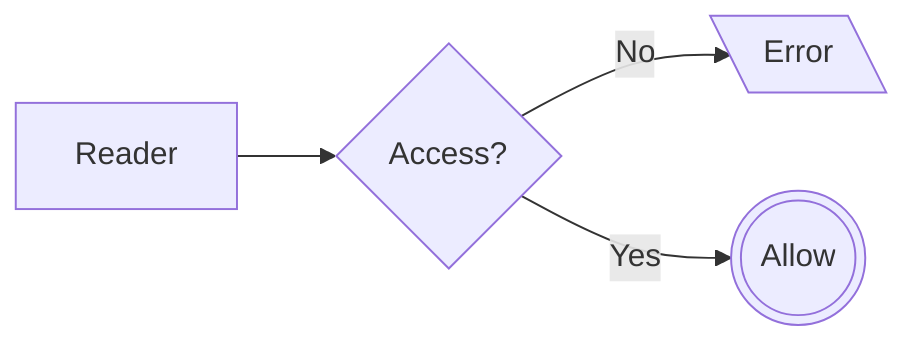

This short guide shows the decision flow when accessing data ("read") or importing data ("write").

* When accessing data to read it:

<center>

</center>

* When importing data to write it to the database, e.g. importing a dataset as table:

    <center>
    ```mermaid
    graph LR
      A[Writer] --> B{Access?};
      B --> |No| C[\Error\];
      B --> |read| C;
      B --> |write_own| D{Owner?}
      D --> |No| C;
      D --> |Yes| E(((Allow)));
      B --> |write_all| E;
    ```
    </center>

A user wants to give specific users read access to a private database.

### UI

As a database owner, you can give specific users access to your database, only you can do this. Create access for
another user, you can use the box to search and specify the level of access.

<video autoplay loop>
  <source src="/infrastructures/dbrepo/1.13/videos/database-access.webm" type="video/webm" />
  <source src="/infrastructures/dbrepo/1.13/videos/database-access.mp4" type="video/mp4" />
</video>

### Python

To give a user (with id `e9bf38a0-a254-4040-87e3-92e0f09e29c8` access to this database (e.g. read access), update
their access using the HTTP API:

```python
from dbrepo.RestClient import RestClient
from python.dbrepo.api.dto import AccessType

client = RestClient(endpoint="http://<hostname>", username="foo",
                    password="bar")
client.create_database_access(<database_id>,
                              type=AccessType.READ,
                              user_id="e9bf38a0-a254-4040-87e3-92e0f09e29c8")
```

In case the user already has access, use the method `update_database_access` or revoke `delete_database_access`.