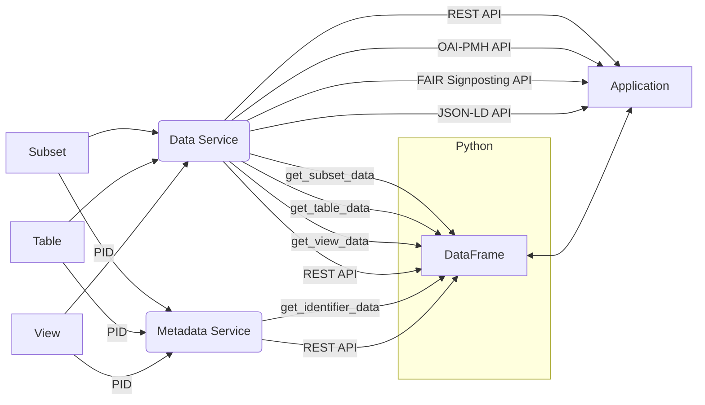

<center>

</center>

A user wants to access and download data from a data source, e.g. a view.

### UI

The UI can be used to fetch data. The data preview can be used to explore data by navigating through the fetched data
with the arrows and selecting a bigger page size.

<video autoplay loop>
  <source src="/infrastructures/dbrepo/1.13/videos/fetch-data.webm" type="video/webm" />
  <source src="/infrastructures/dbrepo/1.13/videos/fetch-data.mp4" type="video/mp4" />
</video>

Export the complete data of the data source by clicking the "Download" button.

<video autoplay loop>
  <source src="/infrastructures/dbrepo/1.13/videos/export-data.webm" type="video/webm" />
  <source src="/infrastructures/dbrepo/1.13/videos/export-data.mp4" type="video/mp4" />
</video>

### Python

* Subset

```python
from dbrepo.RestClient import RestClient

client = RestClient(endpoint="http://<hostname>", username="foo",
                    password="bar")
df = client.get_subset_data(<database_id>,
                            subset_id='5cdd08b7-4c6d-483e-b857-0eeaa86c59b4',
                            size=1000000)
```

* Table

```python
from dbrepo.RestClient import RestClient

client = RestClient(endpoint="http://<hostname>", username="foo",
                    password="bar")
df = client.get_table_data(<database_id>,
                           table_id='c0e9dd95-f43a-4e2f-a5e8-755e058cf118',
                           size=1000000)
```

* View

```python
from dbrepo.RestClient import RestClient

client = RestClient(endpoint="http://<hostname>", username="foo",
                    password="bar")
df = client.get_view_data(<database_id>,
                          view_id='32567e6c-f9ce-4b08-b350-88a7e2a7e291',
                          size=1000000)
```
