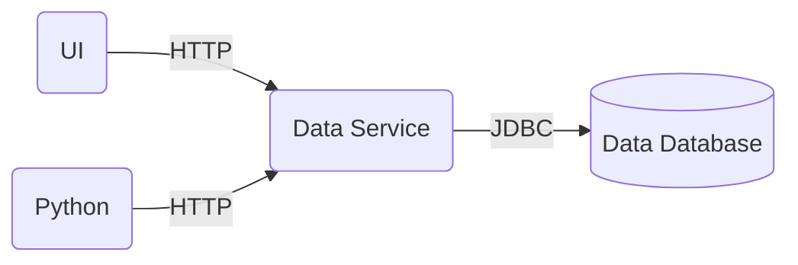

<center>

</center>

A user wants to import a static dataset (e.g. from a .csv file). In this action, a table will be created in the
database.

Importing a dataset required at least `write-own` access, see [Database Access](/database-access). If you are the
owner of the database, you are good to go by default.

### UI

Click on "Create Table" in the database toolbar at the top. Then give the table a name, optional description (this
can be added at a later point as well) and set the visibility settings for transparency and insights. In this example
the dataset will be fully visible to the world.

<video autoplay loop>
  <source src="/videos/import-dataset-1.webm" type="video/webm" />
  <source src="/videos/import-dataset-1.mp4" type="video/mp4" />
</video>

In the next step, provide the dataset structure, the default will be sufficient for most cases.

Select the CSV dataset, it will upload the dataset automatically and analyse the contents to recommend the
table structure including separator (e.g. `,`), newline terminator (e.g. `\n`), comments and lines to skip to infer the
headers.

<video autoplay loop>
  <source src="/videos/import-dataset-2.webm" type="video/webm" />
  <source src="/videos/import-dataset-2.mp4" type="video/mp4" />
</video>

Next, confirm or correct the dataset schema that has been automatically recommended. For example, change the data type
if it was incorrectly analysed. You need to select one or more columns to be the primary key that must contain a unique
(combination of) values. Typically, this will be a column named `id` or similar.

<video autoplay loop>
  <source src="/videos/import-dataset-3.webm" type="video/webm" />
  <source src="/videos/import-dataset-3.mp4" type="video/mp4" />
</video>

The import settings in the import page already takes over the settings from the previous page. You need to click
"Import Data". The table now contains the dataset.

<video autoplay loop>
  <source src="/videos/import-dataset-4.webm" type="video/webm" />
  <source src="/videos/import-dataset-4.mp4" type="video/mp4" />
</video>

### Python

!!! info "Python Compatibility"

    Ensure that you use the same Python library version as the target instance. For example: if you see `1.9.2` in the
    bottom left, you need to use the `1.9.2` Python library.

You can import a dataset from a `pandas` DataFrame via our Python library.

* Table from Dataset

```python
from dbrepo.RestClient import RestClient
from pandas import DataFrame

df = DataFrame({'some_col': 123})

client = RestClient("http://<hostname>", username="foo", password="bar")
table = client.create_table(<database_id>,
                            "Cool Table",
                            is_public=True,
                            is_schema_public=True,
                            dataframe=df)
print(f"table id: {table.id}")
```

* Import Data into existing Table

```python
from dbrepo.RestClient import RestClient
from pandas import DataFrame

df = DataFrame({'some_col': 123})

client = RestClient("http://<hostname>", username="foo", password="bar")
client.import_table_data(<database_id>,
                         table_id='4ce60952-13d3-430f-a2ad-93e4759542a0',
                         dataframe=df)
```