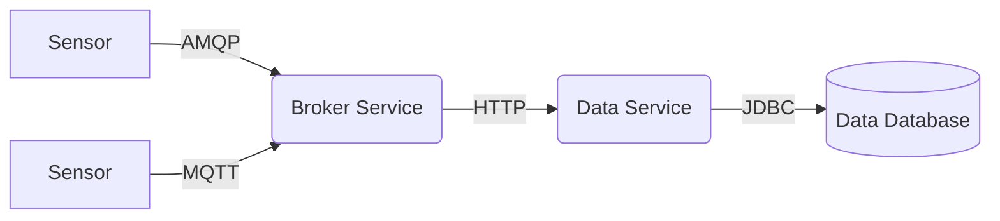

<center>

</center>

DBRepo supports advanced data import through asynchronous data mechanisms. The Broker Service offers two protocols
commonly used by Internet of Things (IoT) infrastructures: AMQP and the lightweight MQTT.

Find the advanced data import details for importing live data on the data source info page.

<figure markdown>

</figure>

A user wants to import live data from e.g. sensor measurements into a table in DBRepo. The user needs to have at least
`write-own` access to write data into a table owned by them.

### Python

* AMQP

```python
from dbrepo.AmqpClient import AmqpClient

client = AmqpClient(broker_host="<hostname>", broker_port=5672, username="foo",
                    password="bar")
client.publish("dbrepo.<database_id>.<table_id>", {'precipitation': 2.4})
```

* MQTTv5

```python
from dbrepo.MqttClient import MqttClient

client = MqttClient(broker_host="<hostname>", broker_port=1883, username="foo",
                    password="bar")
client.publish("dbrepo.<database_id>.<table_id>", {'precipitation': 2.4})
```
